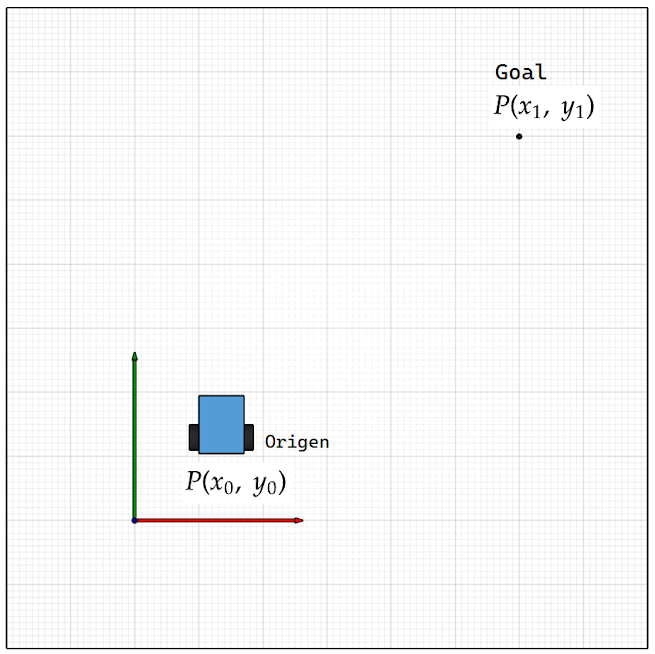
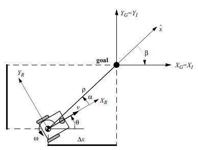
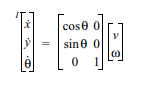
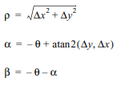
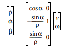
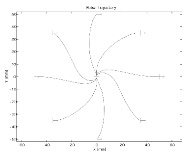

#  Investigación: Algoritmo "Go to Point" Simple
 **TSR-2023-I** Tarea *02* 

## Contenido

- [Objetivo](#objetivo)
- [Introducción](#introduccion)
- [Desarrollo](#desarrollo)
- [Autor](#autor)
- [Referencias](#referencias)

## Objetivo
Un robot móvil del **tipo (2,0)** se encuentra en el punto **P(x0, y0)** con una rotación de **θ** radianes en su eje **Z**. Se requiere llegar al punto **P(x1, y1)** sin importar su orientación (**θ** radianes de giro sobre su eje **Z**).  
  
Investigar el algoritmo _"_**_Go to point simple_**_"_ para cumplir con la tarea expuesta en el problema.  
En la investigación se debe proponer el código del algoritmo usando los datos del problema.  
Contestar a as preguntas:  
¿Cuales son las ventajas y desventajas de utilizar la función atan2?  
¿Cómo variaría el algoritmo si la orientación  
**"θ"** en el P1 fuera necesaria?  
¿A que tribuye los errores de orientación y distancia que se producen durante el movimiento?


## Introducción
El movimiento de un robot móvil se puede describir matemáticamente mediante su cinemática, esta depende de la configuración del robot y sus características físicas, en este caso un robot diferencial, o (2,0). Además de la cinemática del robot, se tiene la planeación de rutas para el movimiento, para este caso se trabajará el movimiento simple go to point simple, que se describirá en la siguiente sección.



## Desarrollo
Para la planeación de trayectorias de un robot se sigue la siguiente metodología:
Se guarda el espacio de configuración del robot, es decir el espacio libre y el espacio ocupado
se guarda un punto meta
Para el punto se comprueba que este pertenezca al espacio de configuración
Se traza un vector desde el punto origen del robot hacia el punto destino
se determinan los parámetros del vector



donde x. y y. son las velocidades lineales en el cuadro inercial





Un resultado de las trayectorias se muestra a continuación:


[^1]
```
def euclidean_distance(self, goal_pose):
	#Euclidean distance between current pose and the goal.	
	return sqrt(pow((goal_pose.x - self.pose.x), 2) + 
	pow((goal_pose.y - self.pose.y), 2))
def linear_vel(self, goal_pose, constant=1.5):
	return constant * self.euclidean_distance(goal_pose)
	def steering_angle(self, goal_pose):
	return atan2(goal_pose.y - self.pose.y, goal_pose.x - self.pose.x)
 def angular_vel(self, goal_pose, constant=6):
	return constant * (self.steering_angle(goal_pose) - self.pose.theta)

 while self.euclidean_distance(goal_pose) >= distance_tolerance:
 # Porportional controller.
 # Linear velocity in the x-axis.
	 vel_msg.linear.x = self.linear_vel(goal_pose)
	 vel_msg.linear.y = 0
	 vel_msg.linear.z = 0
	 # Angular velocity in the z-axis.
	 vel_msg.angular.x = 0
	 vel_msg.angular.y = 0
	 vel_msg.angular.z = self.angular_vel(goal_pose)
	 # Publishing our vel_msg
	 self.velocity_publisher.publish(vel_msg)
	 # Publish at the desired rate.
	 self.rate.sleep()
 # Stopping our robot after the movement is over.
 vel_msg.linear.x = 0
 vel_msg.angular.z = 0
 self.velocity_publisher.publish(vel_msg)
``` 
[^2]Código tomado del ejemplo del turtlebot sim.

¿Cuáles son las ventajas y desventajas de utilizar la función atan2?  
La función atan2 nos proporciona el rango completo del ángulo, pues no se limita a los primeros dos cuadrantes, es decir que nos entrega un valor entre 0 y 360°

¿Cómo variaría el algoritmo si la orientación  
θ en el P1 fuera necesaria?  
Al llegar a la posición se pregunta si se tiene la orientación requerida, si no se tiene se gira para llegar a ella

¿A que tribuye los errores de orientación y distancia que se producen durante el movimiento?
Estos errores se podrían generar por los controladores de los motores, pues el frenado no es   instantáneo, o a la velocidad de muestreo de los encoders en las llantas, también es posible que las condiciones del medio donde el robot navega tengan   diferentes niveles de fricción, provocando que la llanta patine o gire menos.

## Conclusiones
El algoritmo de movimiento de un robot móvil puede diseñarse de forma libre, pudiendo fijar metas del algoritmo de acuerdo a la complejidad, o   con restricciones de movimiento, aunque un algoritmo puede ser general, este puede adaptarse para una configuración del robot que se tenga.
 

## Autor


**Autor** Sanchez Espinosa Miguel Angel [GitHub profile](https://github.com/MigSE)


## Referencias


[^1]: R. Sigwart, introduction to Autonomus Mobile Robots, Cambridge: MIT Press, 2004.

[^2]: Open Robotics, «Go to Goal,» 07 10 2021. En línea]. Available: http://wiki.ros.org/turtlesim/Tutorials/Go%20to%20Goal. [Último acceso: 07 11 2022].
